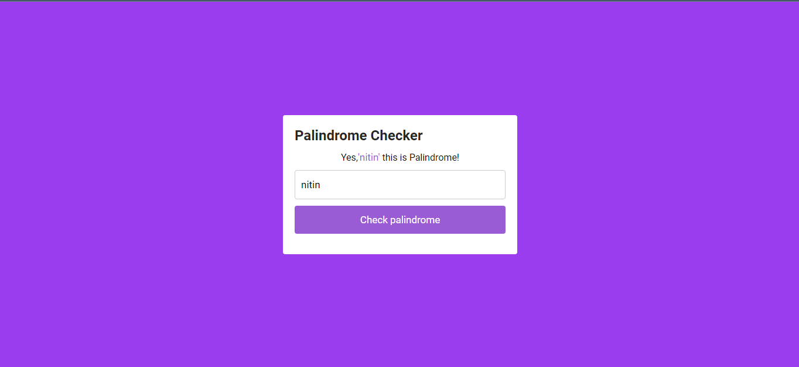

# THIS IS SIMPLE PALINDROME CHECKER WEB APPLICATION

### What is palindrome Text or Number?
- A Palindrome is a word or phrase that reads the same backwards as forwards,e.g.level,refer.

## Technology used

- HTML
- CSS
- JAVASCRIPT

[live link](http://abhijs20.netlify.app)